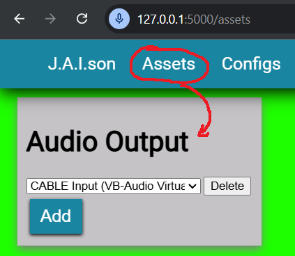
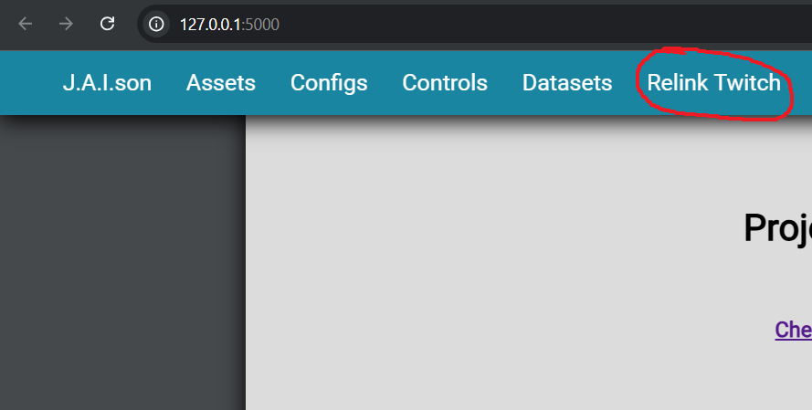
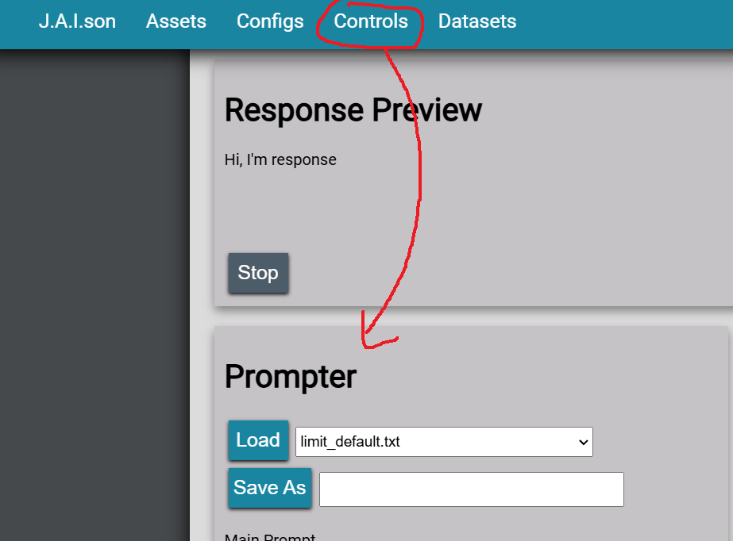
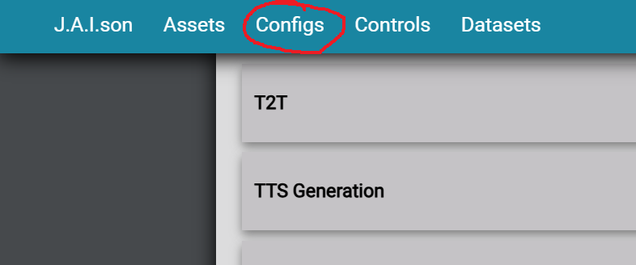

**Force install pip24.0 for conda in order to install rvc dependencies without conflict**
**Need to install ffmpeg stuff from conda or something**

# J.A.I.son
[Setup](#setup) | [Linking Twitch](#linking-twitch) | [Customizing responses](#customizing-t2t) | [Customizing voice](#customizing-voice) | [Configuration](#configuration) | [Running bot](#running-bot)

## Setup
This was made with Python v3.12.18. It was ran in WSL2 Ubuntu and Windows, running an Intel CPU with an RTX 4070 with the latest drivers installed. This is unlikely to be runnable for non-Nvidia systems without stripping code in its current state.

**TO AVOID DEPENDENCY ISSUES, IT IS HIGHLY ADVISED TO USE CONDA FOR YOUR VIRTUAL ENVIRONMENT**

### Step 1: Before starting

1. Install [CUDA](https://developer.nvidia.com/cuda-toolkit)
2. Install ffmpeg
    1. Either follow [this guide](https://www.hostinger.com/tutorials/how-to-install-ffmpeg)
    2. Or for Linux: `sudo apt install ffmpeg`
    3. Or for Windows: Install [ffmpeg](https://huggingface.co/lj1995/VoiceConversionWebUI/blob/main/ffmpeg.exe) and [ffmprobe](https://huggingface.co/lj1995/VoiceConversionWebUI/blob/main/ffprobe.exe), put files in project root
3. Install [conda](https://docs.conda.io/projects/conda/en/stable/user-guide/install/index.html) for managing virtual environment (Miniconda is recommended)

### Step 2: Setting up voice
In this project, TTS is done by first generating speech then applying an AI voice-changer. Generating speech is done in 1 of 2 ways: old-school speech synthesis and AI voice generation. 

Old-school speech synthesis uses [SAPI5](https://learn.microsoft.com/en-us/previous-versions/windows/desktop/ms723627(v=vs.85)) for Windows (no additional setup is required) and [eSpeak NG](https://github.com/espeak-ng/espeak-ng/blob/master/docs/guide.md) for Linux (you will need to install and set that up).

For AI TTS, this project makes use of OpenAI's API. This project currently does not have an option for locally ran AI TTS options, however you may add them by implementing the TTS generation classes.

Lastly, for the AI voice-changer, **YOU WILL NEED THE [RVC-PROJECT](https://github.com/limitcantcode/Retrieval-based-Voice-Conversion-WebUI)**. Follow the setup instructions there for your system ([english instructions](https://github.com/limitcantcode/Retrieval-based-Voice-Conversion-WebUI/blob/main/docs/en/README.en.md)) Please refer to ["Customizing voice"](#customizing-voice) for more details.

### Step 3: Setting up the VTuber
This project makes use of [VTube Studio](https://denchisoft.com/) to render the VTuber model. After [customizing your VTube model](#customizing-vtuber),you will need to go to `General Settings & External Connections` in settings. First enable the plugins API:


Keep note of the API address listed here. If running on WSL, you will need to replace the IP address (`0.0.0.0` in `ws://0.0.0.0:8001`) with the actual IP address of the computer you are running VTube Studio on (you can simply use your home network IPv4 address, gotten by running `ipconfig` in a Command Prompt and should start with `192.168...`).

Further down, you will need to enable the microphone:


You may select either Simple or Advanced Lipsync, it doesn't matter. If you select Advanced Lipsync, you need to click `Set up in model` (`Ok` on deleting parameters if it asks).


Before leaving to the next part, pick the microphone input. It is recommended you use a [virtual audio cable](https://vb-audio.com/Cable/), setting the microphone input as this cables output.

It is also recommended to use the audio multiplexor in this Projects web UI to input into this cable. You need to remain on this page and have your device added for audio to output.



Next, in VTube Studio, go to the `Model Settings` and find paramters for mouth open and mouth form. Change the input to form and open to `VoiceFrequency` and `VoiceVolumn` respectively.


The first time you run this project, you will need to authenticate some plugins on VTube Studio. A pop-up will automatically appear. Just hit `Allow` on both plugins.


These were just the minimal setup instructions to connect the program to your VTube model and sync mouth movement to speaking, however there is still more to do to setup animations and general VTuber movement/expressions. Refer to [Customizing Vtuber](#customizing-vtuber) and [Configuration](#configuration)

### Step 4: Setting up this project
It is recommended to work from within a conda virtual environment. Assuming you are using conda:

Create and activate environment
```bash
conda create -n jaison-core python=3.12 ffmpeg cudatoolkit -c nvidia -y
conda activate jaison-core
```

Install dependencies in this order

1. Install pytorch specific to your system.
- You can see your CUDA version by typing `nvidia-smi` in a terminal.
Should look like the following (for CUDA 12.4)
```bash
conda install pytorch torchvision torchaudio pytorch-cuda=12.4 -c pytorch -c nvidia
```

2. Install Unsloth (unfortunely a requirement right now with how I coded things)
```bash
pip install "unsloth[colab-new] @ git+https://github.com/unslothai/unsloth.git"
pip install --no-deps trl peft accelerate bitsandbytes
```

3. Install [xFormers](https://github.com/facebookresearch/xformers?tab=readme-ov-file#installing-xformers) specific to your system.

4. Install remainder of dependencies
```bash
pip install -r -U requirements.txt
```

5. Create a `.env` file at the root of this project based on `.env-template`.
You can find you OpenAI API token [here](https://platform.openai.com/api-keys) as shown below:


You can find you Discord Bot token from the [dashboard](https://discord.com/developers/applications) after creating a bot as shown below:


Ensure your bot has the right OAuth2 permissions when it joins your server (Scope -> Bot, Bot Permissions -> Administrator if unsure).

Values for Twitch are optional, but instructions are in the next section.

## Linking Twitch
If you want to include stream information (events and chat) from specific Twitch channels, you need to link your Twitch account. Firstly, change your configuration following [Configuration](#configuration) and change `twitch_broadcaster_id` to the Twitch account ID of the streamer and `twitch_user_id` to your own Twitch account ID. Then, you need to register a new application on [Twitch's Dev Console](https://dev.twitch.tv/console).


You can name it whatever you want. Just give it the following `OAuth Redirect URLs`, `Category`, and `Client Type`.


Once you created your new application, click `Manage` and copy the `Client ID` and `Client Secret` into your `.env`.

Finally, on this project's web UI, click `Relink Twitch` and follow the steps there until you've reached the completion page. You should only need to do this once unless you delete the token file under `./src/utils/twitch/`.



## Customizing T2T
For training custom AI T2T models, refer to the `README.md` in `./scripts` directory.

For customizing instructions, you can create prompts either in the web UI in the Prompter or in a text file under `./prompts/production`.



You can set the current prompt in the Prompter as well when you click `Load` of `Save As`. You can also enable and disable the use of certain contexts when generating responses here.

The prompt in these files are a simple character description and context for the situation. It should be like describing an acting role to a person and not like trying to prompt an AI (a lot more instructions are added on top of this prompt by this project).

Prompts also support variables for reuse. Specifying `{name}` anywhere in a prompt (even multiple times) will be replaced with the value in your config under `t2t_prompt_params` or `Prompt Parameters` under `T2T`. This configuration is a dictionary where the key is the variable and the value is the replacing literal.

On the same page as the Prompter, you can also find a tool to create one-time special instructions to use in the next response, as well as a tool for managing name translations which allows you to turn a Discord displayed name into an actual, defined name.

## Customizing voice
We don't train direct TTS AI models, but rather AI voice changers using the [RVC-PROJECT](https://github.com/limitcantcode/Retrieval-based-Voice-Conversion-WebUI). You can find a translation of their docs under the `/docs/` directory. Follow the instructions to setup the project, run the web UI, and train a model with you desired voice. **YOU WILL NEED TO BE ABLE TO RUN CUDA TO TRAIN A VOICE**. It is recommended you have a GPU with at least 8GB of dedicated VRAM (not shared or combined with system RAM). If you encounter `CUDA out of memory` errors or something similar, try training smaller models. An RTX 3070 with 8GB or VRAM could only train a v1 model with pitch at 40k sample rate, using both rvmpe_gpu and rvmpe, on a batch size of 1 with no caching. You want to just train a model (be patient after clicking the button, it can take a couple minutes to kick in) and you may ignore training a feature index. If you still have trouble training due to memory, you can swap the pretrained base models from `f0X40k.pth` to just `X40k.pth` where X is either `D` or `G` accordingly.

## Customizing VTuber
This section DOES NOT go over making a model or the basics of how to use VTube Studio (there are plenty of tutorials online). Instead, this section will explain how to get animations and actions from VTube Studio into this project.

Firstly, in VTube Studio, navigate to the `Hotkey Settings & Expressions`. We will add an animation, but the process is the same for expressions and other hotkeyable actions. Here you will find a list of hotkeys and actions:


Create as many as you like. Just make sure the name is unique. For each animation, selection `Play Animation...` within `Hotkey Action`, and select the animation you want to play (in my case, `idle1` which for me is in `idle1.motion3.json`). You can create animations by recording yourself performing with `Record Live2D Animation` found at the bottom of `Webcam ... Settings`, or you can create them using Live2D Cubism editor (same one used for making a custom model). Again, there are video tutorials for this.

For our project to use these hotkeys, create a config under `configs/hotkeys`. There are some examples there.


In that same directory is a list of detectable emotions. We map a group of detectable emotions to a group of hotkeys that can potentially be played when that emotion is detected. We refer to each mapping as a "hotkey set". In the above example, we have "hotkey sets" `idle`, `happy`, `agree`, etc (seen on the right). The first "hotkey set" is the set of hotkeys that will be used when idle (not speaking). You may still put emotions in there. Furthermore, **ONLY USE DETECTABLE EMOTIONS ONCE**. That emotion will only be used in the first "hotkey set" listed if it appears in multiple. Detectable emotions go under the `emotions` list while the name of the hotkey goes into the `hotkeys` list.

Your hotkeys are now all setup. To use this hotkey configuration, put the file path to that configuration in your components config file under the key `vts_hotkey_config_file`.

Everytime you run this project and things are setup, you may find the following section in the outputs:


These are meant to help you see which detectable emotions or existing VTube Studio hotkeys were not included in the config file (`... not assigned`) and which in the config isn't a detectable emotion or VTube Studio hotkey (`... not found`).

## Configuration
It is recommended you run the project using the example configuration `example.json`, then using the configuration manager in the web UI (you may need to manually fix `vts_url` in the config file before this can work changing the url as described in the beginning of [this setup](#step-3-setting-up-the-vtuber)). Fill all the fields here, specify the file name you want to save to, and save the config.



If you want to change the configurations outside of the web UI, you can find all config files under `./configs/components`. Below is a description of the values:

- t2t_default_prompt_file: (str) A prompt filename within `./prompts/production`
- t2t_prompt_params: (dict) Map of variables in a prompt to their actual value (look at a prompt file to see what variables exist)
- t2t_name_translation_file: (str) A name translation filename within `./configs/name`
- t2t_convo_retention_length: (int) Length of conversation history to keep for generating T2T responses
- t2t_enable_context_script: (bool) Whether to include conversation history by default
- t2t_enable_context_twitch_chat: (bool) Whether to include twitch chat by default (currently does nothing)
- t2t_enable_context_twitch_events: (bool) Whether to include twitch events by default (currently does nothing)
- t2t_enable_context_rag: (bool) Whether to include RAG information by default (currently does nothing)
- t2t_enable_context_av: (bool) Whether to include audio-visual information by default (currently does nothing)
- t2t_host: (str) One of `openai` or `local`
- t2t_model: (str) Name of model to use from the host such as `gpt-4o-mini` from `openai`
- ttsg_host: (str) One of `openai` or `old` (speech synthesis)
- ttsg_voice: (str) Name of voice to use from the host such as `nova` from `openai`
- ttsc_url: (str) URL of RVC Project gradio server, typically `http://localhost:7865`
- ttsc_voice: (str) Name of voice model to use, so just `my-voice-model` with no extensions or anything
- ttsc_transpose: (int) Semitones to repitch voice
- ttsc_feature_ratio: (float) `0` to `1`. Higher more strongly converts accents
- ttsc_median_filtering: (int) `0` to `7`. Higher applies strong filtering, helping with breathiness
- ttsc_resampling: (int) `0` to `48000`. Output audio's sample rate
- ttsc_volume_envelope: (float) `0` to `1`. Higher makes volume more consistent instead of matching original volume
- ttsc_voiceless_protection: (float) `0` to `0.5`. Higher applies less protection of voiceless consenants and breaths
- vts_url: (str) URL of VTube Studio server, typically `ws://localhost:8001` (see [VTube Studio setup](#step-3-setting-up-the-vtuber))
- vts_hotkey_config_file: (str)  A hotkey config filename within `./configs/hotkeys`
- twitch_broadcaster_id: (str, optional) Target streamer Twitch account ID 
- twitch_user_id: (str, optional) Your own Twitch account ID 
- discord_server_id: (int, optional) Discord server ID for Discord bot

## Running bot
### Step 1: Ensure dependency apps are running
1. In a separate terminal, run the RVC-Project (In the same way you [ran the web-UI to train](#customizing-voice), run the web-UI to start the voice-conversion server using `python ./infer-web.py` with the right virtual environment activated)
2. Run VTube Studio with the [Plugin API enabled](#step-3-setting-up-the-vtuber)

### Step 2: Getting the right configuration
Refer to [Configuration](#configuration). You may use `example.json` for a first run.

### Step 3: Start running
To run, simply use the following from the project root:
```bash
python ./src/main.py --config=config.json
```

To get a full list of options, run:
```bash
python ./src/main.py --help
```

## Logging
Logs are stored in `./logs` by default. Changing the log directory (an option when starting the project) requires the new directory to subfolders `sys`, `dialog`, and `response`.

`sys` contains system logs for each of the main application, VTube studio plugins, and the Discord bot. Only certain logs are sent to the console as well, but all logs are sent to files (except for those generated by dependencies such as Discord.py).

`dialog` contains the entire conversation history in the same format used for generating T2T responses. This is useful for creating new datasets and monitoring conversations.

`response` contains entries immediately usable to train T2T AI models. These contain the time, system prompt, user prompt, and generated response for every response made by the T2T model in use. This is useful for cherrypicking favorable responses to retrain the model on.