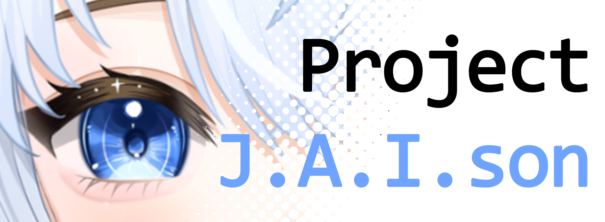

<h1 align="center">Project J.A.I.son</h1>



<h4 align="center">Core server for building AI Companion applications.</h4>

<p align="center">
  
  
  
  
  
</p>

<p align="center">
  <a href="#key-features">Key Features</a> •
  <a href="#applications">Applications</a> •
  <a href="#install">Install</a> •
  <a href="#operations">Operations</a> •
  <a href="#how-to-use">How To Use</a> •
  <a href="#Community">Community</a> •
  <a href="#thank-you-to-all-the-contributors">Credits</a> •
  <a href="#license">License</a>
</p>

## Key Features

- Configurable AI persona that integrates with applications for general interaction and streaming
- Text and talk with AI persona in real-time
- Support for various services and local models
- Support for custom contexts

## Applications

> **API DOCUMENTATION COMING SOON**

Currently made applications:
- [Discord bot integration](https://github.com/limitcantcode/app-jaison-discord-lcc)
- [VTube Studio with emotions](https://github.com/limitcantcode/app-jaison-vts-hotkeys-lcc)
- [Twitch Chat and Events content provider](https://github.com/limitcantcode/app-jaison-twitch-lcc)

## Install

> **Note**
> To simplify setup across platforms, setup now uses [conda](https://docs.conda.io/projects/conda/en/stable/user-guide/install/index.html). Conda is not necessary to run this project.

### Setup and install dependencies

Create and enter a virtual environment with specific Python and pip version.
```bash
conda create -n jaison-core python=3.12 pip=24.0 -y
conda activate jaison-core
```

<hr />

Install [PyTorch 2.5.1](https://pytorch.org/get-started/previous-versions/) with the right integration. Example below for computers with RTX graphics card.
```bash
conda install pytorch==2.5.1 torchvision==0.20.1 torchaudio==2.5.1 pytorch-cuda=12.4 -c pytorch -c nvidia
```

> For NVidia cards, ensure you have the latest drivers and [CUDA toolkit](https://developer.nvidia.com/cuda-toolkit)

<hr />

Install remaining dependencies.
```bash
pip install .
python -m spacy download en_core_web_sm
```

<hr />

Install FFmpeg
#### For Ubuntu/Debian users
```bash
sudo apt install ffmpeg
```
#### For MacOS users
```bash
brew install ffmpeg
```
#### For Windows users
Download executables and place them in the root folder:
- [Download latest `ffmpeg-git-essentials.7z`](https://www.gyan.dev/ffmpeg/builds/)
- Extract and copy all contents from `bin/` to root of this project.

<hr />

Add keys and other sensitive information for services you intend to use in `.env` (make a new file and copy the contents of [`.env-template`](.env-template))


<hr />

Dealing with duplicate `libiomp5md.dll`.
1. Go to environment directory (where conda stores installed packages)
2. Search for `libiomp5md.dll`
3. Delete the version under package `torch`

### Configuration

An [example configuration](configs/example.yaml) is provided. Depending on which integrations are configured for use, additional setup is required.

#### General

- `web_host` (str) ip address of your server host. Default to 127.0.0.1 (if having issues connecting from another machine, try 0.0.0.0)
- `web_port` (int) port to run REST API and websocket server on.

#### Prompting

Find prompt files for personality and scenario under `prompts/characters` and `prompts/scenes` respectively. There are also general instructions, but you shouldn't need to edit this. Place your prompt text file here and specify the filename in the config under `..._prompt_filename`

#### Operations

See [Operations](#operations-1) for the extensive list.

## Operations

These are listed under `operations` in configuration. Each operation specified a `type` and an `id`. Valid options are descripted below.

### stt

#### kobold

- **compatibility** -> all
- **paid** -> no

Use [KoboldCPP](https://github.com/LostRuins/koboldcpp) for speech-input.

Download the [Kobold executable](https://github.com/LostRuins/koboldcpp/releases). Also download one of [their whisper models](https://huggingface.co/koboldcpp/whisper/tree/main). Save these to `models/kobold`. Open the executable, link the model, and save the configuration to `models/kobold`.

For configuration, add the absolute filepath of the executable to `kobold_filepath` and the kobold config to `kcpps_filepath`.

Additional configuration
- `kobold_stt_suppress_non_speech` (bool) for skipping non-speech sounds
- `kobold_stt_langcode` (str) for code of input language

#### azure

- **compatibility** -> all
- **paid** -> no

Use [Azure Speech Services](https://learn.microsoft.com/en-us/azure/ai-services/speech-service/index-speech-to-text) for speech-input.

Add your API key to `.env` under `AZURE_API_KEY` and [region](https://learn.microsoft.com/en-us/azure/ai-services/speech-service/regions?tabs=geographies) under `AZURE_REGION`

Configuration:
- `azure_stt_language` (str) Input speech [language](azure_stt_language)

#### fish

- **compatibility** -> all
- **paid** -> yes

Use [Fish Audio](https://fish.audio/) for speech-input.

Add your API key to `.env` under `FISH_API_KEY`

No additional configuration

#### openai

- **compatibility** -> depends
- **paid** -> depends

Default to use [OpenAI's service](https://platform.openai.com/docs/overview), which is compatible with all but paid. Can also be used with applications/services that have OpenAI-like API such as Ollama.

Add your API key to `.env` under `OPENAI_API_KEY`

Configuration:
- `openai_stt_base_url` (str) for specifying endpoint (OpenAI or some other application/service)
- `openai_stt_model` (str) model to use
- `openai_stt_language` (str) [language](https://github.com/openai/whisper/blob/main/whisper/tokenizer.py)

### t2t

#### openai

- **compatibility** -> depends
- **paid** -> depends

Default to use [OpenAI's service](https://platform.openai.com/docs/overview), which is compatible with all but paid. Can also be used with applications/services that have OpenAI-like API such as Ollama.

Add your API key to `.env` under `OPENAI_API_KEY`

Configuration:
- `openai_t2t_base_url` (str) for specifying endpoint (OpenAI or some other application/service)
- `openai_t2t_model` (str) for model ID
- `openai_t2t_temperature` (float) for adjusting temperature
- `openai_t2t_top_p` (float) for adjusting top P
- `openai_t2t_presence_penalty` (float) for adjusting presence penalty
- `openai_t2t_frequency_penalty` (float) for adjusting frequency penalty

#### kobold

- **compatibility** -> limited
- **paid** -> no

Direct support for models on [KoboldCPP](https://github.com/LostRuins/koboldcpp). More flexible samplers than OpenAI-like APIs.

- `kobold_t2t_max_context_length` (int) max context length of model
- `kobold_t2t_max_length` (int) max length allowable for model
- `kobold_t2t_quiet` (bool) quiet output
- `kobold_t2t_rep_pen` (float) sampler
- `kobold_t2t_rep_pen_range` (int) sampler
- `kobold_t2t_rep_pen_slope` (int) sampler
- `kobold_t2t_temperature` (float) sampler
- `kobold_t2t_tfs` (int) sampler
- `kobold_t2t_top_a` (int) sampler
- `kobold_t2t_top_k` (int) sampler
- `kobold_t2t_top_p` (float) sampler
- `kobold_t2t_typical` (int) sampler

### tts

#### azure

- **compatibility** -> all
- **paid** -> no

Use [Azure Speech Services](https://learn.microsoft.com/en-us/azure/ai-services/speech-service/index-text-to-speech) for natural sounding synthesized speech.

Add your API key to `.env` under `AZURE_API_KEY` and [region](https://learn.microsoft.com/en-us/azure/ai-services/speech-service/regions?tabs=geographies) under `AZURE_REGION`

Configuration:
- `azure_ttsg_voice` (str) ID of void from [voice gallery](https://speech.microsoft.com/portal/voicegallery) (ID used in their sample code for `speech_synthesis_voice_name`)

#### fish

- **compatibility** -> all
- **paid** -> yes

Use [Fish Audio](https://fish.audio/) for voice-cloned text-to-speech.

Add your API key to `.env` under `FISH_API_KEY`

Configuration:
- `fish_model_id` (str) for voice model ID
- `fish_model_backend` (str) for model to use
- `fish_normalize` (bool) for normalizing input message for clearer pronunciation
- `fish_latency` (str) one of "normal" (stable) or "balanced" (faster but choppy)

#### openai

- **compatibility** -> depends
- **paid** -> depends

Default to use [OpenAI's service](https://platform.openai.com/docs/overview), which is compatible with all but paid. Can also be used with applications/services that have OpenAI-like API.

Add your API key to `.env` under `OPENAI_API_KEY`

Configuration:
- `openai_ttsg_base_url` (str) for specifying endpoint (OpenAI or some other application/service)
- `openai_ttsg_voice` (str) for voice name
- `openai_ttsg_model` (str) for voice model

#### pytts

- **compatibility** -> limited
- **paid** -> no

Use system's speech synthesizer (SAPI for Windows, ESpeak for Linux) to generate speech.

Configuration:
- `synth_ttsg_voice_name` (str) for voice ID (a list of these is printed on start when configured to be used)
- `synth_ttsg_gender` (str) for voice gender if applicable

#### kobold

- **compatibility** -> limited
- **paid** -> no

Use [KoboldCPP](https://github.com/LostRuins/koboldcpp) for TTS. Mostly for completion sake, and not recommended for use.

Configuration:
- `kobold_tts_voice` (str) voice to use

### filter_audio

#### pitch

- **compatibility** -> all
- **paid** -> no

Pitch generated audio up and down a number of semi-tones

Configuration:
- `pitch_amount` (int) pitch shift in semi-tones

#### rvc

- **compatibility** -> limited
- **paid** -> no

Use voice changers trained using [RVC](https://github.com/RVC-Project/Retrieval-based-Voice-Conversion-WebUI).

Setup can be a little extensive. It is recommended to make a separate project to get necessary dependencies. Download the [RVC-project](https://github.com/RVC-Project/Retrieval-based-Voice-Conversion-WebUI) and follow [steps to install pre-models](https://github.com/RVC-Project/Retrieval-based-Voice-Conversion-WebUI/blob/main/docs/en/README.en.md#preparation-of-other-pre-models). Copy the contents of `assets/` into this project's `assets/rvc`.

To add your model, move the model weights from RVC's `assets/weights` into this project's `assets/rvc/weights`. Also move the index file from `logs/<your model>` to `models/rvc/<your model>`.

Ensure your `.env` contains everything for RVC and shown in the template.

Configuration:
- `rvc_voice` (str) for model name
- `rvc_f0_up_key` (int) for changing voice pitch
- `rvc_f0_method` (str) for generation method
- `rvc_f0_file` (str) for frequency filepath
- `rvc_index_file` (str) for index filepath
- `rvc_index_rate` (float) for index rate
- `rvc_filter_radius` (int) 
- `rvc_resample_sr` (int) for resampling audio to another sample rate
- `rvc_rms_mix_rate` (int)
- `rvc_protect` (float)

### filter_text

#### filter_clean

- **compatibility** -> all
- **paid** -> no

Accumulate output from T2T model into sentences before passing them down the pipeline.

No additional configuration

#### chunker_sentence

- **compatibility** -> all
- **paid** -> no

Accumulate output from T2T model into sentences before passing them down the pipeline.

No additional configuration

#### mod_koala

- **compatibility** -> limited
- **paid** -> no

Use [Koala/Text-Moderation](https://huggingface.co/KoalaAI/Text-Moderation) to categorize and filter offensive responses.

No additional configuration

#### emotion_roberta

- **compatibility** -> all
- **paid** -> no

Use [SamLowe/roberta-base-go_emotions](https://huggingface.co/SamLowe/roberta-base-go_emotions) to castegorize response into an emotion.

No additional configuration

## How To Use

```bash
python ./src/main.py --help
```

Example usage: `python ./src/main.py --config=example`

## Community

Join the community!

- [Discord](https://discord.gg/Z8yyEzHsYM)
- [Youtube](https://www.youtube.com/@LimitCantCode)
- [Twitch](https://www.twitch.tv/atmylimit_)

## Thank you to all the contributors!

<a href="https://github.com/limitcantcode/jaison-core/graphs/contributors" target="_blank">
  
</a>

## License

[MIT](LICENSE)
