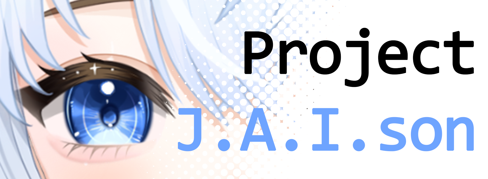

<h1 align="center">Project J.A.I.son</h1>



<h4 align="center">Core server for building AI Companion applications.</h4>

<p align="center">
  
  
  
  
  
</p>

<p align="center" >
  <a href="#about-this-project">About</a> •
  <a href="#key-features">Features</a> •
  <a href="#official-applications">Applications</a> •
  <a href="#quick-start">Quick Start</a> •
  <a href="#developer-guide">Developer Guide</a> •
  <a href="#community">Community</a> •
  <a href="#contributors">Contributors</a> •
  <a href="#license">License</a>
</p>

---

# About This Project

Project J.A.I.son is a fully customizable AI companion server designed for streaming, private companionship, or building interactive AI applications. Run it entirely locally or leverage cloud services—the choice is yours.

This software uses libraries from the FFmpeg project under the LGPLv2.1.

---

## Key Features

- **Real-time AI Personality** - Text and speech input with customizable character prompts
- **MCP Support** - Integrate Model Context Protocol servers for extended capabilities
- **REST API & WebSocket Server** - Build custom applications on top of the core server
- **Flexible Deployment** - Run fully local or use cloud services (Azure, OpenAI, Fish Audio, etc.)
- **Modular Pipeline** - Mix and match STT, TTS, LLM, and filter operations

---

## Official Applications

Extend J.A.I.son with these official integrations:

- **[Discord Bot](https://github.com/limitcantcode/app-jaison-discord-lcc)** - Chat with your AI in Discord servers
- **[VTube Studio Emotions](https://github.com/limitcantcode/app-jaison-vts-hotkeys-lcc)** - Trigger VTube Studio expressions based on AI emotions
- **[Twitch Integration](https://github.com/limitcantcode/app-jaison-twitch-lcc)** - React to chat and channel events on Twitch

Build your own applications using our [Developer Guide](#developer-guide)!

---

# Quick Start

## Basic Installation

> Windows need to enable [Developer Mode](https://learn.microsoft.com/en-us/windows/apps/get-started/enable-your-device-for-development)

This project uses [uv](https://docs.astral.sh/uv/) and Make ([Windows](https://gnuwin32.sourceforge.net/packages/make.htm) | [Linux](https://www.gnu.org/software/make/) (usually provided by the distro)) for setup and development.

```bash
# Regular setup
make setup

# Development setup
make dev
```

### Hardware Acceleration

Enable GPU usage by installing [PyTorch 2.5.1](https://pytorch.org/get-started/locally/) for your hardware and OS.

## Configuration

1. Copy `.env-template` to `.env` and add your API keys for the services you plan to use.

    ```bash
    cp .env-template .env
    ```

    If running everything locally, you may leave the keys blank:
    ```yaml
    OPENAI_API_KEY=
    FISH_API_KEY=
    AZURE_REGION=
    AZURE_API_KEY=
    ```

2. Create new text files under `prompts\characters`, `prompts\instructions`, and `prompts\scenes`, as required. Describe the character/instruction/scene as you'd like. Remember that you can create as many as you'd like and easily switch between them. An example for each is provided.

3. Copy `configs\example.yaml` to `configs\config.yaml` (you can name it whatever you'd like). This is the name you'll use when running the main server!
Select the desired operations (refer to **[Development Guide](DEVELOPER.md)**) and set the desired prompt filenames to the ones you created in Step 2:
    ```yaml
    prompter:
    instruction_prompt_filename: 'example.txt'
    character_prompt_filename: 'example.txt'
    scene_prompt_filename: 'example.txt'
    ```

See the **[Development Guide](DEVELOPER.md)** for detailed configuration instructions, including:
- Setting up local services (whisper.cpp, llama.cpp, MeloTTS, RVC)
- Configuring cloud providers (Azure, OpenAI, Fish Audio)
- Customizing prompts and operations
- Choosing the right services for your use case

---

## Running the Server

Inside a terminal inside the project directory
```bash
# Example for configs/example.yaml
uv run ./src/main.py -c example
```

For all available options:
```bash
uv run ./src/main.py --help
```

---

## Developer Guide

Build applications, create custom integrations, or extend J.A.I.son:

- **[Development Guide](DEVELOPER.md)** - Complete configuration reference, service setup, and operations documentation
- **[REST API Specification](api.yaml)** - OpenAPI 3.1.0 spec for the REST API and WebSocket events
- **[Contributing Guidelines](CONTRIBUTING.md)** - How to contribute to the project

---

## Community

Join the community and get help:

- **[Discord](https://discord.gg/Z8yyEzHsYM)** - Project discussions and support
- **[YouTube](https://www.youtube.com/@LimitCantCode)** - Tutorials and showcases
- **[Twitch](https://www.twitch.tv/atmylimit_)** - Live development streams

---

## Contributors

Thank you to everyone who has contributed to Project J.A.I.son!

[Become a contributor](CONTRIBUTING.md)

<a href="https://github.com/limitcantcode/jaison-core/graphs/contributors" target="_blank">
  
</a>

---

## License

[MIT](LICENSE)